# A 4-week Research Internship on VSDSquadron Mini RISC-V Dev Board

[Click here for board link](https://www.vlsisystemdesign.com/vsdsquadronmini/)


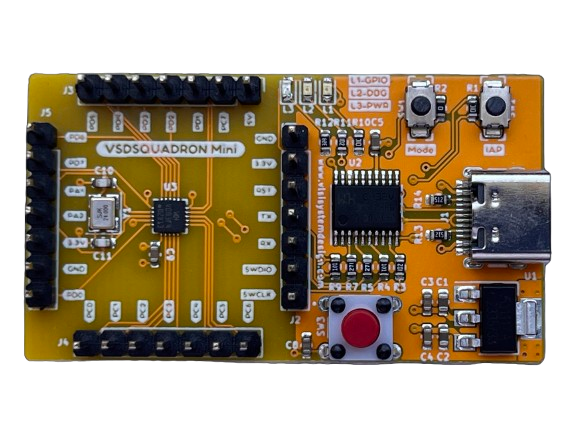

BOARD SPECIFICATIONS:

| Tech specs   |   |    |
|------------|------------|------------|
| **Board** | Name     | VSDSquadron Mini    |
|      | SKU    | VSDSQM    |
| **Microcontroller**    | CH32V003F4U6 chip with 32-bit RISC-V core based on RV32EC instruction set    |     |
| **USB connector** | USB 2.0 Type-C    |     |
| **Pins**     | Built-in LED Pin     | 1X onboard user led (PD6)     |
|      | Digital I/O pins     | 15     |
|      | Analog I/O pins     | 10-bit ADC, PD0-PD7, PA1, PA2, PC4     |
|      | PWM pins     | 14X     |
|      | External interrupts     | 	8 external interrupt edge detectors, but it only maps one external interrupt to 18 I/O ports     |
| **Communication**     | USART     | 	1x, PD6(RX), PD5(TX)     |
|      | I2C     | 1x, PC1(SDA), PC2(SCL)    |
|      | SPI     | 1x, PC5(SCK), PC1(NSS), PC6(MOSI), PC7(MISO)     |
|      | Programmer/debugger     | Onboard RISC-V programmer/debugger, USB to TTL serial port support     |
| **Power**     | I/O voltage     | 3.3 V    |
|      | Input voltage (nominal)     | 5 V    |
|      | Source Current per I/O Pin    | 8 mA     |
|      | Sink Current per I/O Pin     | 8 mA     |
| **Clock speed**     | Processor    | 24 MHz     |
| **Memory**     | SRAM     | 2kb onchip volatile sram,16kb external program memory     |
   

This repo is intended to document the weekly progress.

### The first online meet was held on 16th of Feb 2024 @6PM

<details>
    <summary> TASK 1 </summary>
 
1) install Yosys 

2) install iverilog 

3) install gtkwave

### CLONING RISC-V GNU TOOLCHAIN

## To install git 
```sudo apt install git-all```   

 *make sure to install the dependencies*
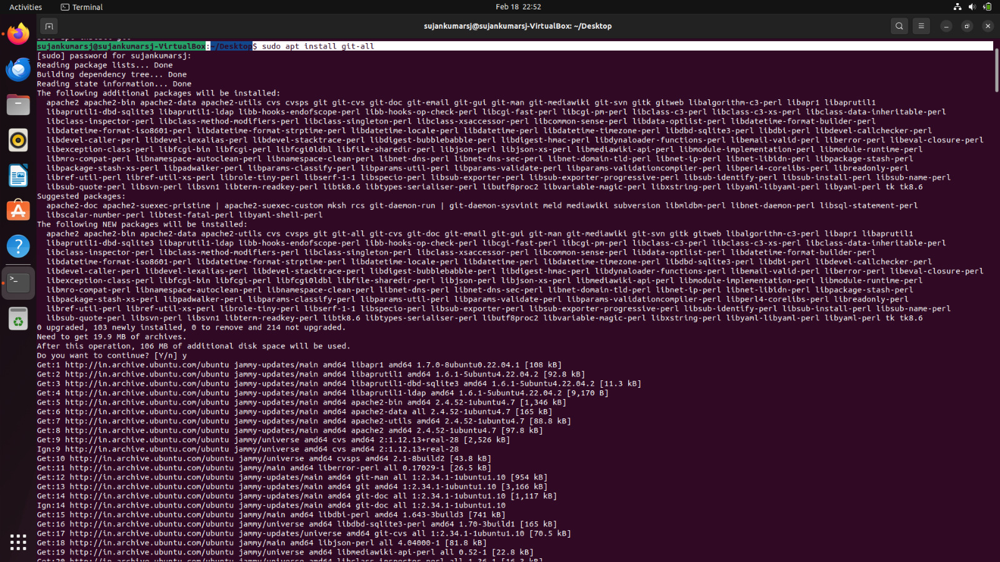


### INSTALLING YOSYS, IVERILOG & GTKWAVE.

### 1.YOSYS


```git clone https://github.com/YosysHQ/yosys.git```
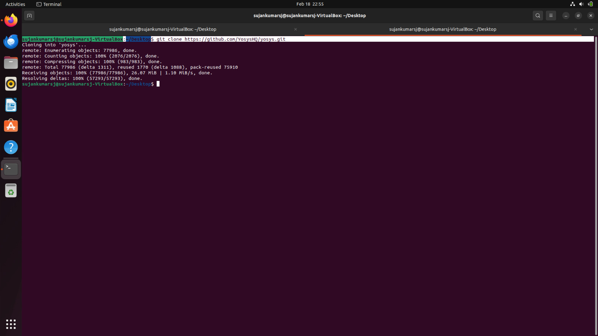
```cd yosys``` 

```sudo apt install make```
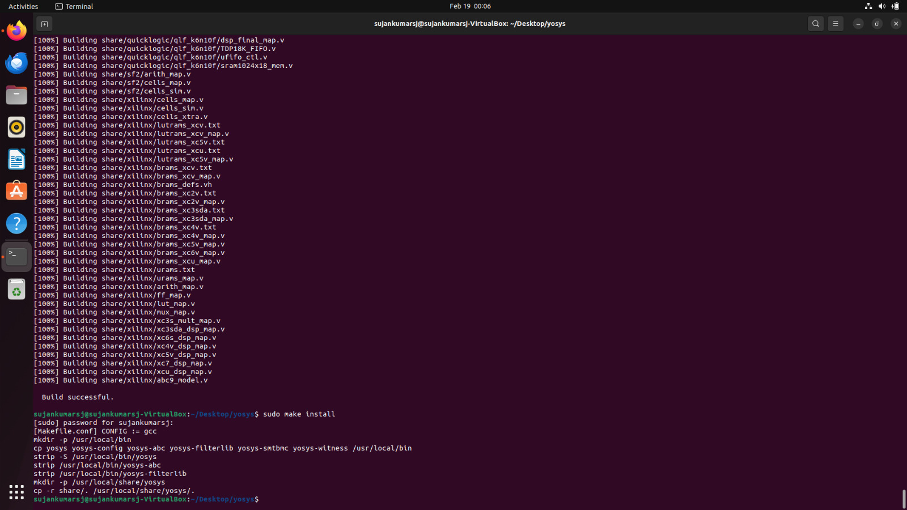
```sudo apt-get install build-essential clang bison flex \libreadline-dev gawk tcl-dev libffi-dev git \ graphviz xdot pkg-config python3 libboost-system-dev\libboost-python-dev libboost-filesystem-dev zlib1g-dev```

```make config-gcc```

```make``` 

```sudo make install```


### 2.iVerilog
*installing iVerilog*

```sudo apt update```

```sudo apt-get install iverilog```
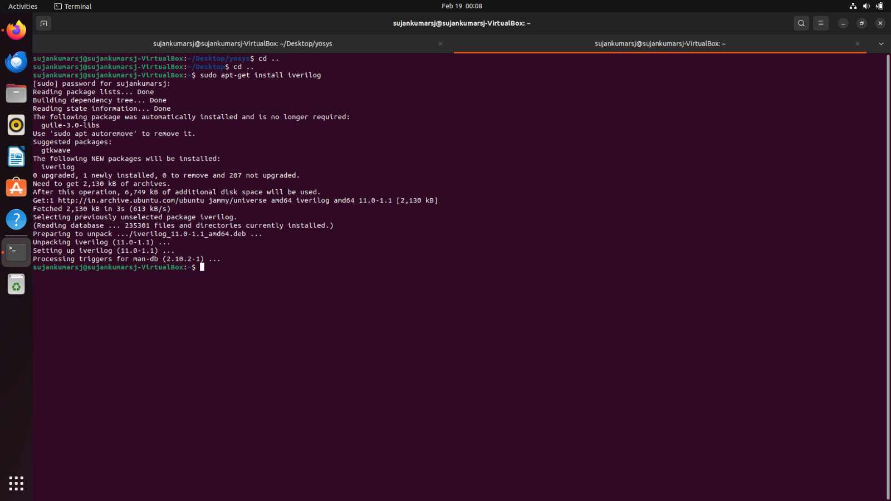

### 3.GTkWave
*installing GTkWave*

``` sudo apt-get install gtkwave ```

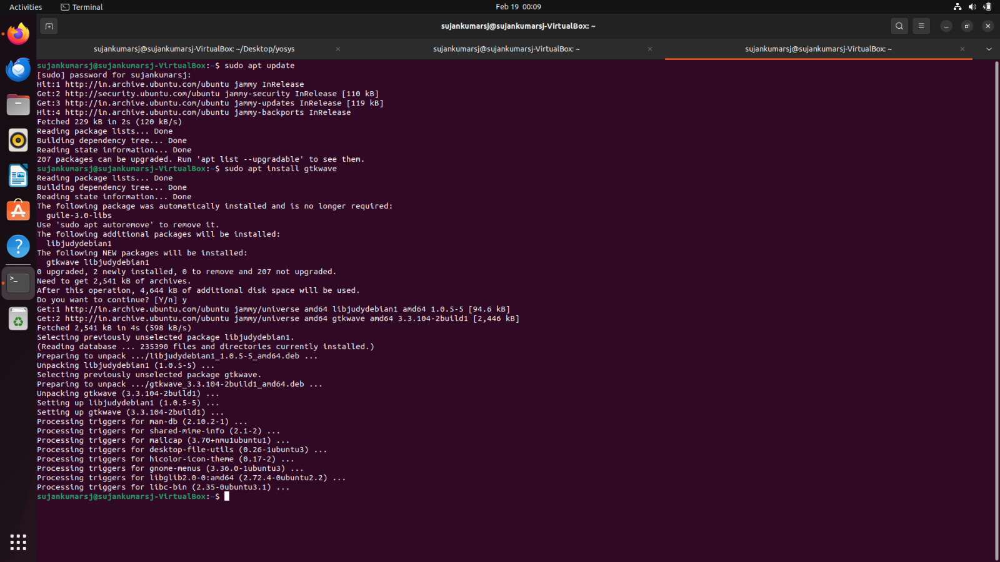
</details>

### The Second online meet was held on 20th of Feb 2024 @6PM

<details>
    <summary> TASK 2 </summary>

### To identify Input ports, input waveforms, output ports and output waveforms of the design.

### Objective:
*The objective here is to design Vending Machine Controller which accepts money inputs(i and j) in any sequence and delivers the products when the required amount has been deposited and gives back the change. Here an additional facility is provided to the user. It is possible to withdraw the deposited money in between if the customer wishes so by pressing a push button(pu).*

### *Column of I/O Elements:*

| Sl.No   | Name of the Pin  | Direction  | Width | Description |
|------------|------------|------------|--------|-----|
| 1. | Product_Out     | Output     |1|Product|
| 2.     | Coin_In    | Input     | 2 |  Only two Coins |
|      |     |      |  | Rs.1 and Rs.2|
| 3.     | Clk     | Input     | 1 | Clock Signal|
| 4.     | Coin_Out   | Output     | 2 |  Only two Coins |
|      |     |      |  | Rs.1 and Rs.2|
| 5.     | Rst    | Input     | 1 | Reset Signal|
| 6.     | En    | Input     | 1 | Enable Signal|


###  *Block Diagram of Vending Machine:*


### *Specifications:*

1. Price of the product =Rs.3
2. Possible money inputs =Rs.2 & Rs.1
3. Product to be delivered when Rs.3 or Rs.4 is reached.
4. A push button is there (pu) which indicates the cancellation of transaction and the return of the amount deposited.


</details>    

### The Third online meet was held on 22th of Feb 2024 @6PM

<details>
    <summary> TASK 3 </summary>

*Cloning my github repositories:*    
```git clone https://github.com/sujankumarsj/VSD.git```


*Simulating iverilog by taking files from the folder verilog_code* 

```cd VSD```

```cd verilog_code```

```iverilog vend.v tb_vend.v```


*Generating dump_file*

```./a.out```

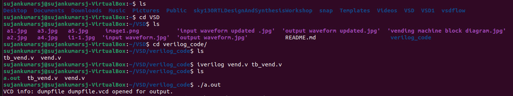

*To get I/O waveform*

```gtkwave dumpfile.vcd```

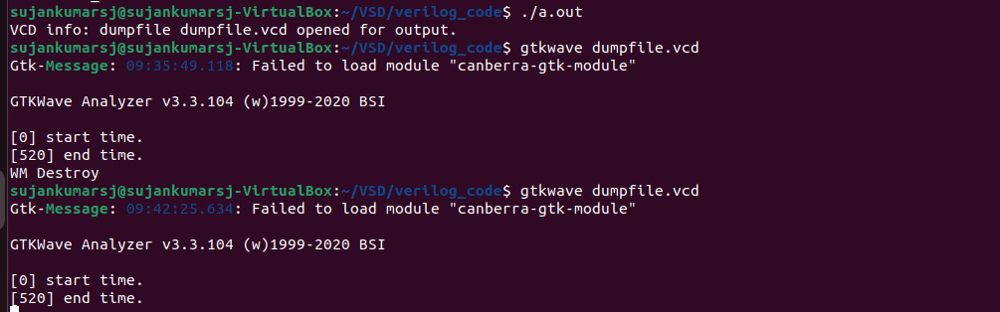

### Wave Forms:
###  *Input Waveform:*


###  *Output Waveform:*


</details> 

### The Forth online meet was held on 27th of Feb 2024 @6PM

<details>
    <summary> TASK 4 </summary>

*Invoking yosys inside verilog_code file:* 

```yosys```

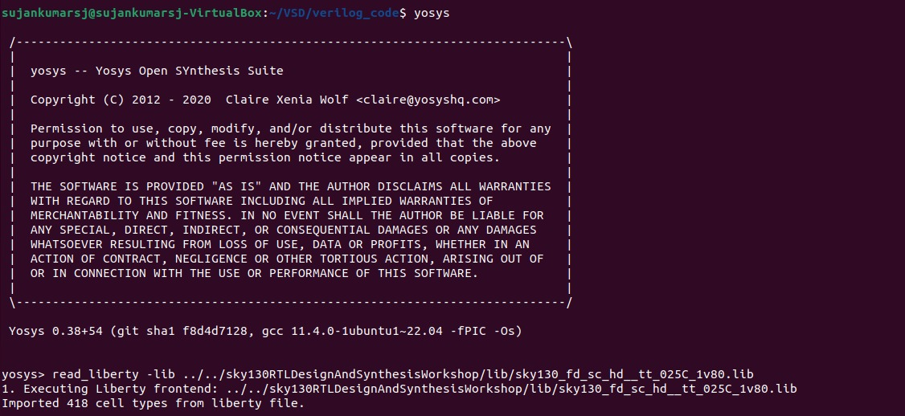


*Reading the Library:*    

```read_liberty -lib ../../sky130RTLDesignAndSynthesisWorkshop/lib/sky130_fd_sc_hd__tt_025C_1v80.lib```


*Reading the Design:*    

```read_verilog vend.v```

*Reading the Design constraints in my sky.v folder:* 

```read_verilog sky.v```

*Specifying the module that we are synthesizing:*    

```synth -top vend```


*To generate the netlist:*    

```abc -liberty ../../sky130RTLDesignAndSynthesisWorkshop/lib/sky130_fd_sc_hd__tt_025C_1v80.lib```


*To see the graphical version of the logic:*    

```show```


*To write the netlist:*    

```write_verilog vend_netlist.v```

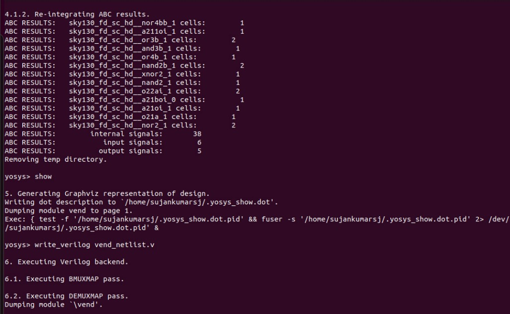

*Using the switch '-noattr' to get the simplified version of netlist file:*    

```write_verilog -noattr vend_netlist.v```

```flatten```

```show```

*To open the netlist:*    

```!gvim vend_netlist.v```


*Opening the netlist file:*

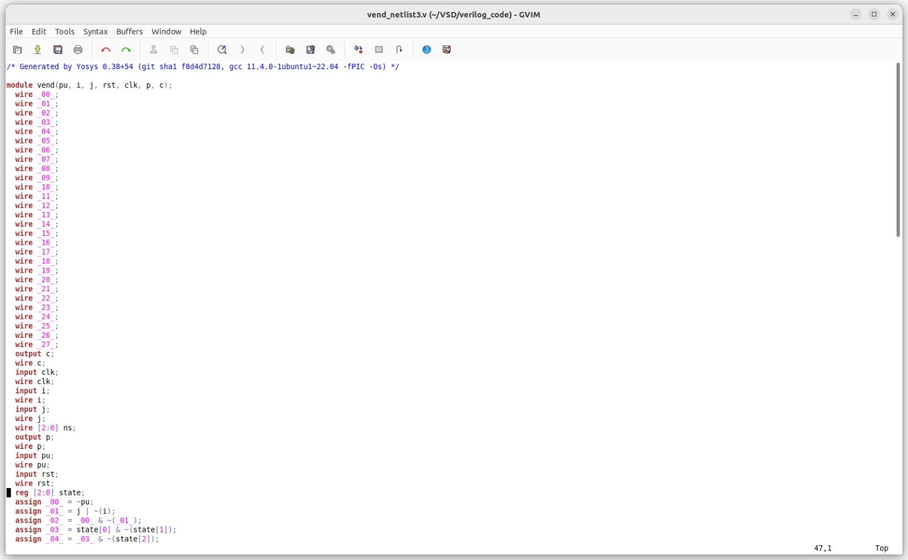

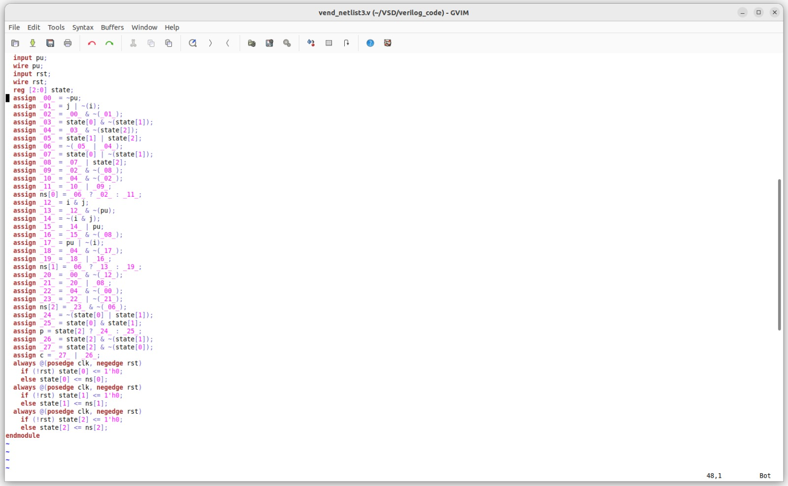

*To check whether the netlist will match with the Design:*

 ```iverilog vend_netlist3.v tb_vend.v``` 

```./a.out``` 

 ```gtkwave dumpfile.vcd```


 *Netlist waveform*


</details>     